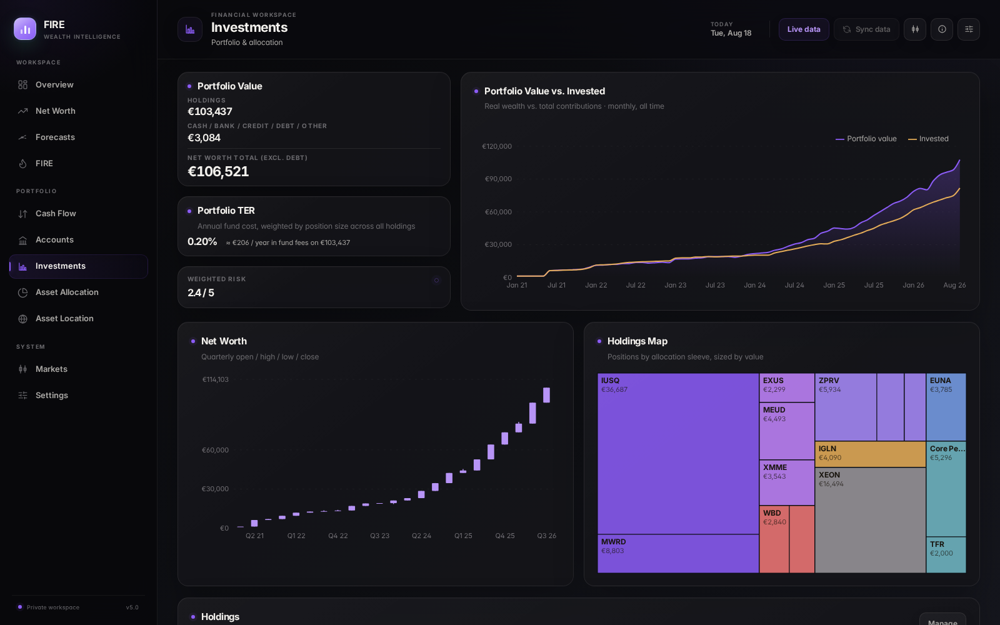
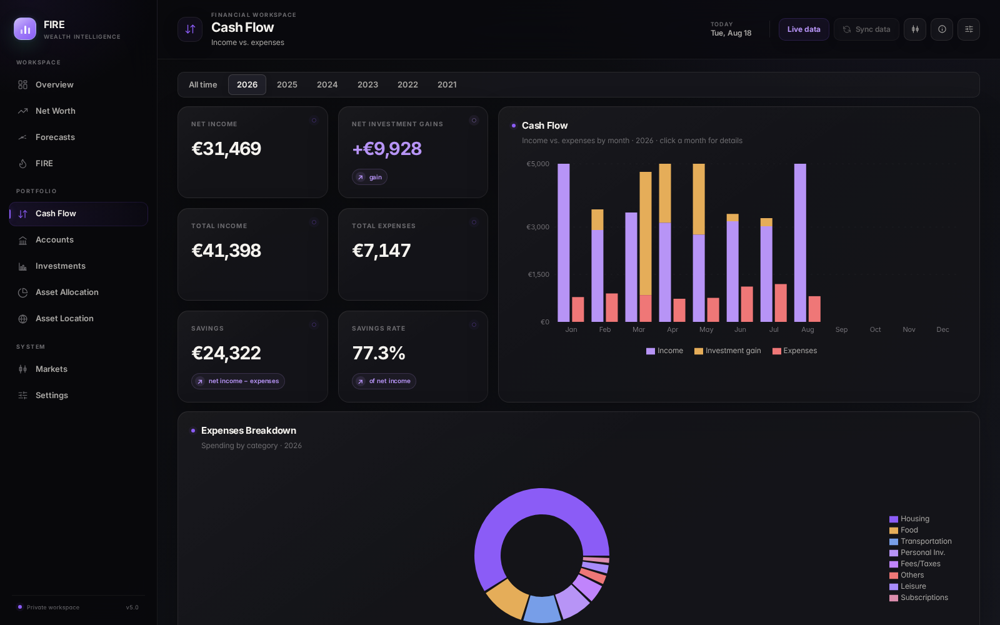
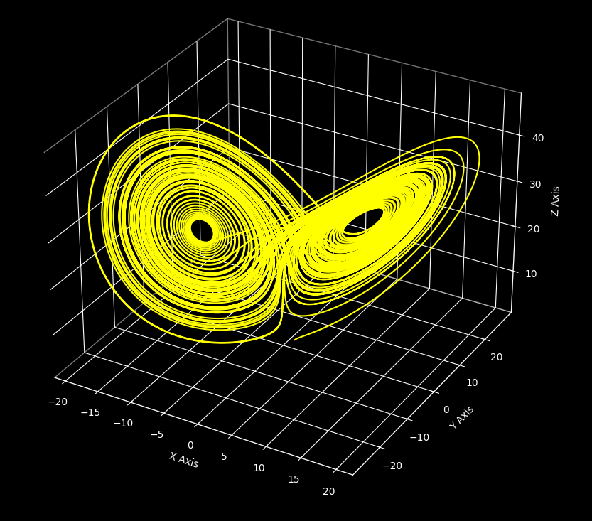

### Hi there, I'm Alberto Foti 👋

I build software around systems, simulation, finance, and low-level programming. My work spans portfolio tools, process simulators, numerical algorithms, and practical developer tooling.

### GitHub Stats

  
  
  
  
  

### Main Projects

  
  

  
  

### Featured Repositories

### Tech & Tools

  
  
  
  
  
  

### Contact

