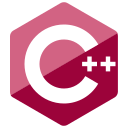

### Hi there, I'm Alberto Foti 👋

I build software around systems, simulation, finance, and embedded/low-level programming. My work spans from portfolio and cash-flow tools to processor emulation and numerical algorithms.

### GitHub Stats

### Main Projects

  
  

  
  

### Featured Repositories

### Templates

### Tech & Tools

  
  
  
  

### Contact

